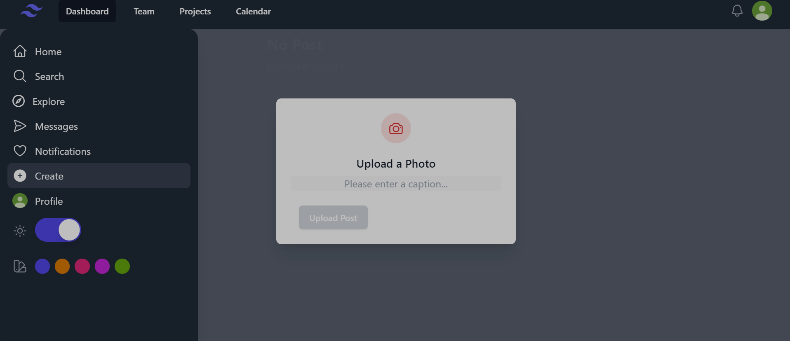
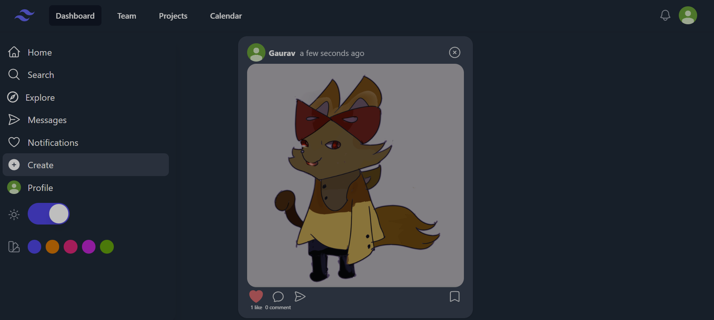
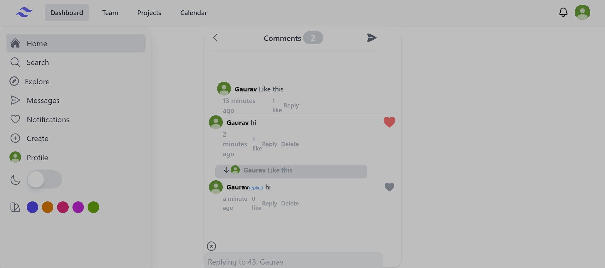
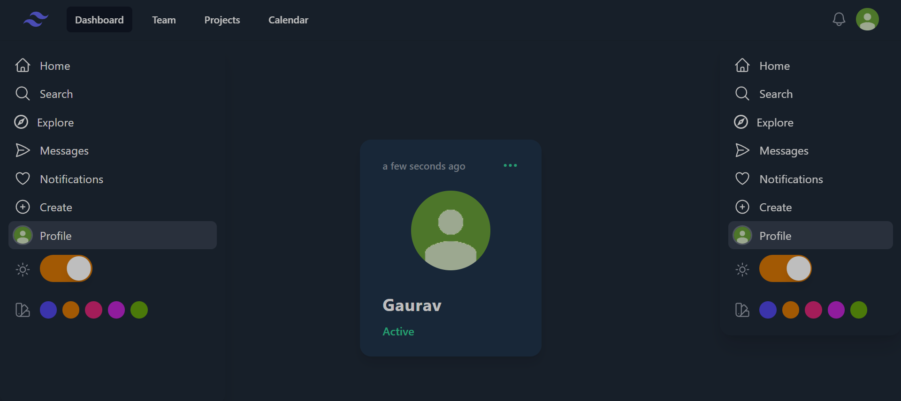

# NextJs Social App
- This is realtime instagram like site

# Screenshots 

# Technologies used : ⚙️
- NextJs
- TailwindCSS and headlessui
- Firebase (firestore database)
- heroicons

# Features 🌟
- Login with Google and Logout
- Fully Responsive
- Can post pictures with caption
- comment, reply, like and like other comments functionality
- Added Profile Page
- Dark Mode and theme option
- user can delete their posts and comment

## Feel Free to Contribute on this project and you may find bugs and post the solution
# Features to contribute
- Add Message Functionality for particular user 
- Add Friend Request Feature
- Add Video Posts with multiple images 